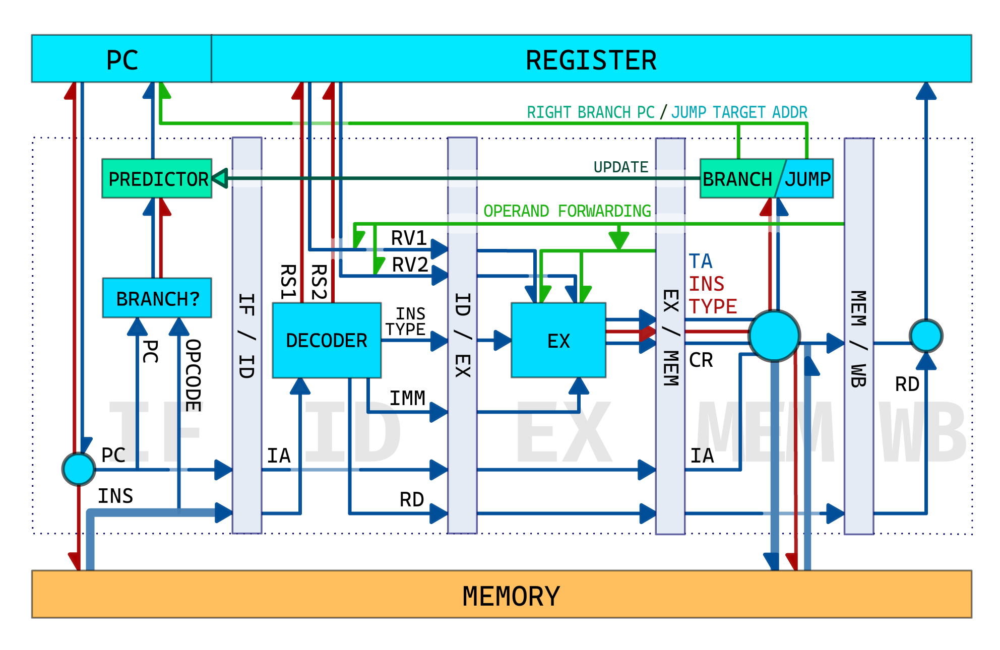

# RISC-V Simulator

## 简介

- 上海交通大学，2020级ACM班，PaperL
- 2020-2021学年暑期小学期，PPCA课程项目
- **使用 C++ 模拟 CPU 五级流水**

## 五级流水设计示意图

### 缩写说明

五级流水各个阶段

| 缩写    | 全称               |
| ------- | ------------------ |
| **IF**  | Instruction Fetch  |
| **ID**  | Instruction Decode |
| **EX**  | Execute            |
| **MEM** | Memory Access      |
| **WB**  | Write Back         |

实现过程中涉及的名词

| 缩写       | 全称                 | 说明                     |
| ---------- | -------------------- | ------------------------ |
| **PC**     | Program Counter      | 待执行的下一条指令地址   |
| *IA*       | Instruction Address  | 当前指令地址             |
| **INS**    | Insturction          |                          |
| **OPCODE** | Operation Code       |                          |
| **RS**     | Register Source      | 读取值的寄存器序号       |
| *RV*       | Register Value       | 获取的寄存器值           |
| **IMM**    | Immediate            | 立即数                   |
| **RD**     | Register Destination | 将写入的寄存器序号       |
| *CR*       | Calculation Result   |                          |
| *TA*       | Target Address       | 跳转或分支指令的目标地址 |

**注：粗体内容为通用缩写。斜体内容为个人起名，不保证在其他资料中含义相同。*

## 文件结构

- **main.cpp**
  - `main` 函数
- **global.h**
  - namespace `HEX`
    - 符号扩展
  - namespace `INSTRUCTION`
    - 指令类型枚举
    - `decode` 函数
  - namespace `STORAGE`
    - 存储器结构体
  - `debug` 调试信息输出函数

- **cpu.hpp**
  - `cpu` 类
    - 成员变量：寄存器对象、内存对象、各个阶段对象、分支预测器对象、全局变量
    - 成员函数：
      - `init()` 以输入流数据初始化内存信息
      - `work()` 按周期模拟 CPU 运行
- **predictor.hpp**
  - `predictor` 类
    - 成员变量：`bht`、`btb`、总预测次数、预测成功次数
    - 成员函数
      - `predictPC` 函数：根据`branch` 指令 `pc` 提供预测跳转 `pc`
      - `update` 函数：以预测结果更新 `bht`、`btb`、预测次数
- **stage.h** / **stage.cpp**
  - 基类 `stage`
    - 成员变量：`preBuffer`、`sucBuffer`
    - 成员函数：构造函数、`run()`
  - 派生类 `stageIF`、`stageID`、`stageEX`、`stageMEM`、`stageWB`
    - 派生变量：所需的引用。例如寄存器对象、内存对象、回传数据所在缓冲区对象

## 分支预测

- 一级分支预测
  - 在 `IF (Instruction Fetch)` 阶段进行分支预测，以 `PC (Program Counter)` 作为预测依据
  - 通过大小为 `4096` 的 `BHT (Branch History Table)` 预测是否跳转
  - 通过大小为 `256` 的 `BTB (Branch Target Buffer)` 获取预测跳转地址
- 二级分支预测
  - 在 `IF (Instruction Fetch)` 阶段进行分支预测，以 `PC (Program Counter)` 作为预测依据
  - 通过大小为 `256` 的 `BHT (Branch History Table)` 获取分支历史记录
  - 通过大小为 `256×64` 的 `PHT (Pattern History Table)` 获取是否跳转
  - 通过大小为 `256` 的 `BTB (Branch Target Buffer)` 获取预测跳转地址
- 成功率（二级分支预测）

`statistics powered by walotta`

| 测试点 | 成功率 | 预测成功次数 | 总预测次数 |
| :----: | :----: | :------------: | :----------: |
|**array_test1**|54.55%|12|22|
|**array_test2**|50.00%|13|26|
|**basicopt1**|99.20%|153893|155139|
|**bulgarian**|94.49%|67555|71493|
|**expr**|68.47%|76|111|
|**gcd**|60.83%|73|120|
|**hanoi**|98.38%|17175|17457|
|**lvalue2**|66.67%|4|6|
|**magic**|85.24%|57850|67869|
|**manyarguments**|80.00%|8|10|
|**multiarray**|55.56%|90|162|
|**naive**|/|0|0|
|**pi**|84.45%|33742332|39956380|
|**qsort**|96.14%|192319|200045|
|**queens**|81.09%|62531|77116|
|**statement_test**|61.88%|125|202|
|**superloop**|98.97%|430549|435027|
|**tak**|80.53%|48832|60639|